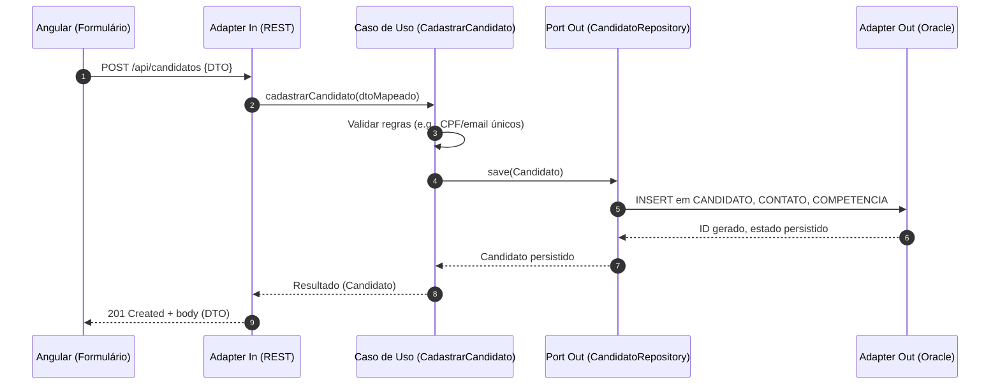
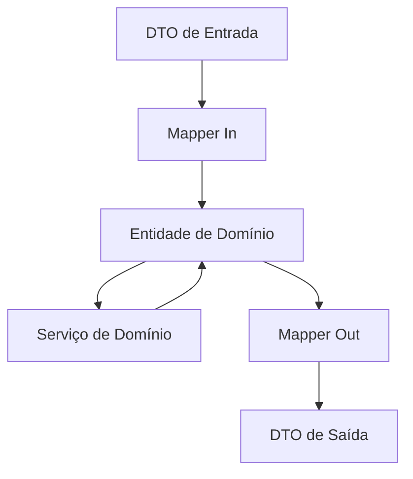
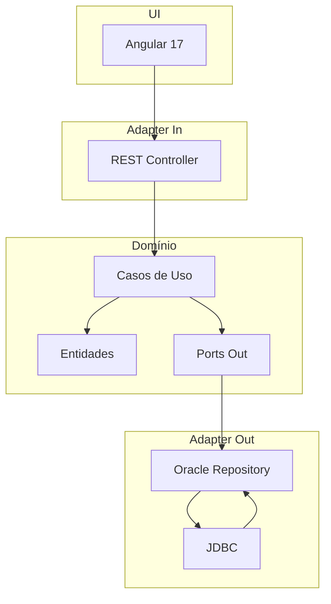

# Banco de Talentos — Documentação de Arquitetura & Fluxo de Dados

> **Stack:** Arquitetura Hexagonal · Backend **Java 17** (sem frameworks) · Frontend **Angular 17 standalone** · **Oracle DB**

Esta documentação descreve em detalhes o **fluxo de dados fim a fim**, a **arquitetura hexagonal** aplicada, contratos de API, mapeamento de camadas, e inclui **diagramas em Mermaid** para apoiar a compreensão e a manutenção do sistema.

---

## 1) Visão Geral
O sistema "Banco de Talentos" permite **cadastrar**, **consultar** e **gerenciar** candidatos. A arquitetura hexagonal isola o **Domínio** das tecnologias externas (UI, HTTP, Banco de Dados), favorecendo testes, manutenção e evolução.

**Domínios principais:**
- **Candidato** (Candidate): dados pessoais, contatos, competências, senioridade, status.
- **Vaga** (JobPosting): título, descrição, requisitos, status.
- **Candidatura** (Application): relacionamento entre Candidato e Vaga, status do processo.

---

## 2) Arquitetura (Hexagonal)

```
          ┌────────────────────────────────────────────────────────┐
          │                        ADAPTERS                        │
          │  UI (Angular)  │  REST (HTTP)  │  Oracle (JDBC)        │
          └──────────────┬─────────────────┬───────────────────────┘
                         │                 │
                   ┌─────▼─────┐     ┌────▼─────┐
                   │  INPUT    │     │  OUTPUT  │
                   │  PORTS    │     │  PORTS   │
                   └─────┬─────┘     └────┬─────┘
                         │                │
                     ┌───▼────────────────▼───┐
                     │        DOMÍNIO         │
                     │  Entidades & Casos de  │
                     │  Uso (Serviços Core)   │
                     └────────────────────────┘
```

- **Domínio**: entidades, regras de negócio e casos de uso (application services). Não conhece HTTP, DB, nem Angular.
- **Ports (Interfaces)**: contratos que o Domínio expõe (input) ou consome (output).
- **Adapters**: implementações concretas para cada tecnologia (REST para input; Oracle/JDBC para output).

**Pacotes sugeridos (backend):**
```
br.com.bancotalentos
├─ domain
│  ├─ model (Entidades e VOs)
│  ├─ port
│  │  ├─ input (Use cases / application services interfaces)
│  │  └─ output (Gateways/Repositories interfaces)
│  └─ service (Implementações dos casos de uso, focadas no domínio)
├─ adapter
│  ├─ in
│  │  └─ rest (Controladores HTTP, DTOs de entrada/saída, mapeadores)
│  └─ out
│     └─ oracle (Implementações de Repositories, DAOs, mapeadores)
└─ config (Fábricas, wiring manual, propriedades)
```

---

## 3) Fluxo de Dados (Fim a Fim)

### 3.1 Cadastro de Candidato (Create)



### 3.2 Consulta Paginada de Candidatos (Read)

```mermaid
flowchart LR
  A[Angular: /candidatos?page=1&size=20&skill=Angular] --> B[REST Controller]
  B --> C{Valida filtros}
  C -->|ok| D[Use Case: listarCandidatos(filtros,paginacao)]
  D --> E[Port Out: CandidatoRepository.search]
  E --> F[Oracle: SELECT com WHERE/LIKE e ROWNUM]
  F --> E
  E --> D
  D --> B
  B --> A
```

### 3.3 Atualização Parcial (PATCH)
- UI envia apenas campos alterados.
- REST aplica **DTO -> comando** e invoca o caso de uso `atualizarCandidatoParcial`.
- Serviço de domínio aplica validações de negócio e chama o `Repository.updatePatch`.

### 3.4 Exclusão (Delete)
- `DELETE /api/candidatos/{id}` → valida dependências (candidaturas ativas) → soft delete (flag `ATIVO = 'N'`).

---

## 4) Contratos de API (REST)
> Padrões: JSON, status codes padrão HTTP, `application/json; charset=utf-8`.

### 4.1 Endpoints de Candidato
- **POST** `/api/candidatos`
  - **Body (exemplo)**
    ```json
    {
      "nome": "Ana Souza",
      "cpf": "12345678901",
      "email": "ana@exemplo.com",
      "telefone": "+55 11 99999-9999",
      "senioridade": "PLENO",
      "competencias": ["Angular", "Java", "SQL"],
      "observacoes": "Disponível para alocação em 30 dias"
    }
    ```
  - **201 Created** → body retorna DTO com `id` e metadados.

- **GET** `/api/candidatos`
  - **Query**: `page`, `size`, `sort`, `skill`, `senioridade`, `nome`.
  - **200 OK** → `{"content": [...], "page": 1, "size": 20, "totalElements": 120}`

- **GET** `/api/candidatos/{id}` → **200 OK** ou **404**
- **PATCH** `/api/candidatos/{id}` → **200 OK** (retorna atualizado) ou **409** (conflitos de negócio)
- **DELETE** `/api/candidatos/{id}` → **204 No Content** (soft delete)

### 4.2 Convenções de Erro
```json
{
  "timestamp": "2026-02-27T04:34:00Z",
  "path": "/api/candidatos",
  "error": {
    "code": "VALIDATION_ERROR",
    "message": "Campo 'email' inválido.",
    "details": [{"field": "email", "reason": "formato"}]
  },
  "correlationId": "b2a1-..."
}
```

---

## 5) Modelo de Domínio (resumo)

**Candidato**
- `id: Long`
- `nome: String`
- `cpf: Cpf` (VO)
- `email: Email` (VO)
- `telefone: Telefone` (VO)
- `senioridade: enum {JUNIOR, PLENO, SENIOR}`
- `competencias: Set<Competencia>`
- `observacoes: String?`
- `ativo: boolean`
- **Invariantes**: CPF único; email válido; não excluir se houver candidatura ativa.

**Port Out (exemplos)**
- `CandidatoRepository`
  - `save(Candidato): Candidato`
  - `findById(id): Optional<Candidato>`
  - `search(Filtros, Paginacao): Page<Candidato>`
  - `updatePatch(id, Patch): Candidato`
  - `softDelete(id): void`

**Casos de Uso (Port In)**
- `CadastrarCandidato`
- `ListarCandidatos`
- `BuscarCandidatoPorId`
- `AtualizarCandidatoParcial`
- `ExcluirCandidato`

---

## 6) Esquema de Banco (Oracle)

```sql
CREATE TABLE CANDIDATO (
  ID            NUMBER GENERATED BY DEFAULT AS IDENTITY PRIMARY KEY,
  NOME          VARCHAR2(120)     NOT NULL,
  CPF           VARCHAR2(11)      NOT NULL UNIQUE,
  EMAIL         VARCHAR2(180)     NOT NULL,
  TELEFONE      VARCHAR2(30),
  SENIORIDADE   VARCHAR2(10)      CHECK (SENIORIDADE IN ('JUNIOR','PLENO','SENIOR')),
  OBSERVACOES   CLOB,
  ATIVO         CHAR(1) DEFAULT 'S' CHECK (ATIVO IN ('S','N')),
  DT_CRIACAO    TIMESTAMP DEFAULT SYSTIMESTAMP,
  DT_ATUALIZACAO TIMESTAMP
);

CREATE TABLE COMPETENCIA (
  ID      NUMBER GENERATED BY DEFAULT AS IDENTITY PRIMARY KEY,
  NOME    VARCHAR2(80) NOT NULL UNIQUE
);

CREATE TABLE CANDIDATO_COMPETENCIA (
  CANDIDATO_ID  NUMBER NOT NULL REFERENCES CANDIDATO(ID),
  COMPETENCIA_ID NUMBER NOT NULL REFERENCES COMPETENCIA(ID),
  PRIMARY KEY (CANDIDATO_ID, COMPETENCIA_ID)
);

CREATE INDEX IDX_CAND_EMAIL ON CANDIDATO(EMAIL);
CREATE INDEX IDX_CAND_NOME ON CANDIDATO(NOME);
```

**Observações:**
- Use `ROWNUM`/`OFFSET FETCH` para paginação conforme versão do Oracle.
- **Soft delete** via `ATIVO`.

---

## 7) Mapeamento DTOs ↔ Domínio (Adapter In/Out)

- **Entrada (REST → Domínio)**: mapear `DTOs` para Entidades/VOs; normalizar telefone; validar CPF.
- **Saída (Domínio → REST)**: nunca expor VOs internos crus; formatar para consumo simples no Angular.



---

## 8) Observabilidade e Correlation ID
- Gerar `correlationId` por requisição (no REST adapter) e propagar até o adapter Oracle.
- Logar **evento de negócio** (início/fim do caso de uso) + **evento técnico** (SQL executado, tempo, linhas).
- Métricas: tempo de resposta por endpoint, taxa de erro, throughput.

---

## 9) Estratégia de Testes
- **Unitários (Domínio)**: invariantes, VO validation, casos de uso sem depender de DB.
- **Contract tests**: Ports com fakes/in-memory.
- **Integração**: adapter Oracle com schema local; dados seeds.
- **End-to-End (API)**: cenários CRUD via HTTP.

---

## 10) Setup de Desenvolvimento (Local)

### 10.1 Backend (Java 17, sem frameworks)
- Estrutura sugerida de módulos:
  - `core-domain` (puro Java)
  - `adapter-rest` (Java + HTTPServer nativo/Jetty embutido se permitido)
  - `adapter-oracle` (JDBC)
  - `bootstrap` (main, wiring manual)
- Variáveis de ambiente:
  - `DB_URL`, `DB_USER`, `DB_PASSWORD`
  - `HTTP_PORT` (ex.: 8080)

### 10.2 Frontend (Angular 17 standalone)
- Lazy modules por áreas: `candidatos`, `vagas`, `candidaturas`.
- Serviços: `CandidatosService` consumindo `/api/candidatos`.
- Formulários reativos + validações (email, CPF, required).

---

## 11) Decisões de Arquitetura (ADR resumidas)
- **Hexagonal** para isolamento tecnológico e testabilidade.
- **Oracle** por requisito corporativo; **soft delete** para auditoria.
- **Sem frameworks no backend** para controle fino e aprendizado.

---

## 12) Roadmap Próximo
- Implementar `PATCH` idempotente com JSON Merge Patch.
- Filtro por **competência** com índice composto.
- Paginação com `OFFSET ... FETCH` (se Oracle 12c+).
- Adicionar **candidaturas** e **vagas** nos próximos incrementos.

---

## 13) Glossário
- **Port In**: interface de caso de uso exposta ao "mundo externo" (ex.: REST chama esta porta).
- **Port Out**: interface consumida pelo domínio para acessar recursos externos (ex.: Repositórios).
- **Adapter**: implementação concreta de um Port para uma tecnologia específica.

---

### Anexo: Diagrama de Camadas (Mermaid)


---

**Autor:** Jonas + M365 Copilot  
**Última atualização:** 27/02/2026
